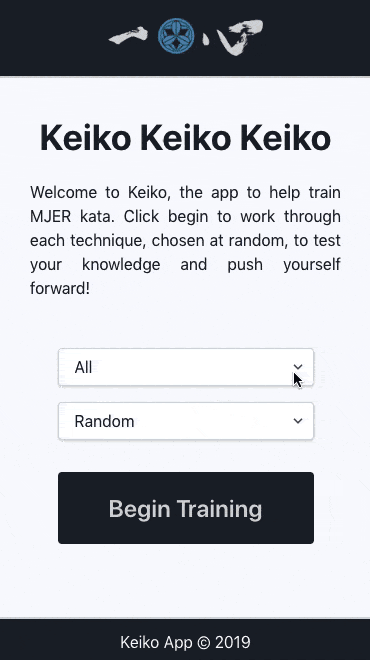

# Keiko

See [Live Demo](https://keiko.komeijyuku.com/)

---

Semi-randomly display waza names for training.
* MJER waza
* Randomly display "next" waza to perform, tracks against ones already completed
* Sequential display
* Supports restarting from the beginning

## Tech stack
* Project generated with create-vue
* Uses Vue3, Pinia, TypeScript and tailwind css

---



---

## Type Support for `.vue` Imports in TS

TypeScript cannot handle type information for `.vue` imports by default, so we replace the `tsc` CLI with `vue-tsc` for type checking. In editors, we need [TypeScript Vue Plugin (Volar)](https://marketplace.visualstudio.com/items?itemName=Vue.vscode-typescript-vue-plugin) to make the TypeScript language service aware of `.vue` types.

If the standalone TypeScript plugin doesn't feel fast enough to you, Volar has also implemented a [Take Over Mode](https://github.com/johnsoncodehk/volar/discussions/471#discussioncomment-1361669) that is more performant. You can enable it by the following steps:

1. Disable the built-in TypeScript Extension
    1) Run `Extensions: Show Built-in Extensions` from VSCode's command palette
    2) Find `TypeScript and JavaScript Language Features`, right click and select `Disable (Workspace)`
2. Reload the VSCode window by running `Developer: Reload Window` from the command palette.

---

## Customize configuration

See [Vite Configuration Reference](https://vitejs.dev/config/).

---

## Project Setup

```sh
npm install
```

### Compile and Hot-Reload for Development

```sh
npm run dev
```

### Type-Check, Compile and Minify for Production

```sh
npm run build
```

### Run Unit Tests with [Vitest](https://vitest.dev/)

```sh
npm run test:unit
```

### Lint with [ESLint](https://eslint.org/)

```sh
npm run lint
```

---

## TODO
* tailwind and vite
* autoprefixing and vite
* lint-staged / husky format and lint on commit
* example vitest
